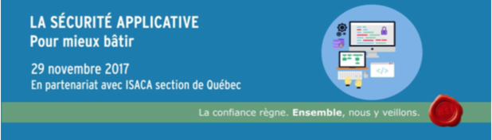
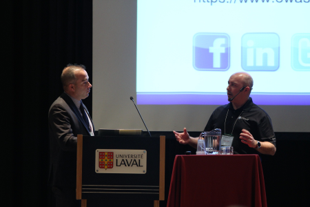
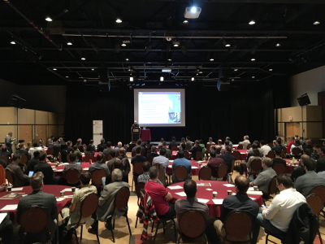

## 29 novembre 2017 - Journée de 6 conférences sur la sécurité applicative à L'Université Laval

 

 
 
  

**Description**

Afin de mettre en avant plan la sécurité applicative à Québec, vos
leaders bénévoles d'OWASP Québec se sont joint à d'autres conférenciers
spécialistes pour cet événement.
  
**"[ISACA Québec](http://www.isaca-quebec.ca/)"** en partenariat avec le
**"[Bureau de sécurité de l’information de l’Université
Laval](https://www.bsi.ulaval.ca/)"** ont organisé cette fantastique
journée sur la **sécurité applicative**.

**Merci aux organisateurs\! Nous étions "sold out" avec 165
inscriptions\!**

**Conférenciers et présentations:**
* Patrick Leclerc :  
  [Fondements de la sécurité applicative et prise en
charge avec les outils
OWASP](http://www.isaca-quebec.ca/assets/presentations/2017-11-29-Fondements%20de%20la%20s%C3%A9curit%C3%A9%20applicative%20et%20prise%20en%20charge%20avec%20les%20outils%20OWASP.pdf)
   
* Martin Renaud :  
  [La sécurité en cours de
développement](http://www.isaca-quebec.ca/assets/presentations/2017-11-29-La%20s%C3%A9curit%C3%A9%20en%20cours%20de%20d%C3%A9veloppementF.pdf)
  
* François Lajeunesse-Robert :  
[Sécuriser avec de bonnes pratiques de
test](http://www.isaca-quebec.ca/assets/presentations/2017-11-29-S%C3%A9curiser%20avec%20de%20bonnes%20pratiques%20de%20testF.pdf)
  
* François Harvey :  
[Revue de
code](http://www.isaca-quebec.ca/assets/presentations/2017-11-29-La%20revue%20de%20codeF.pdf)
  
* Patrick Chevalier :  
  [Les tests d’intrusion dans le cadre du cycle de
développement
applicatif](http://www.isaca-quebec.ca/assets/presentations/2017-11-29-Tests%20de%20s%C3%A9curit%C3%A9%20dans%20le%20cadre%20du%20cycle%20de%20d%C3%A9veloppementF.pdf)
  
* Louis Nadeau :  
  [Modèles de
maturité](http://www.isaca-quebec.ca/assets/presentations/2017-11-29-OWASP%20SAMM%20et%20les%20mod%C3%A8les%20de%20maturit%C3%A9.pdf)

 

