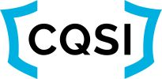

## 13 avril 2018 - OWASP Québec au CQSI 2018: "Buzzwords et enjeux de sécurité"

 

**Patrick Leclerc**
 **Louis Nadeau**
 OWASP QC
  

#### Description

Dans le cadre du **"[CQSI](https://www.cqsi.org/)"**, OWASP Québec
(Patrick Leclerc et Louis Nadeau) ont donné une conférence: **"Buzzwords
et enjeux de sécurité"**

Cloud, DevOps, CI/CD, Microservices... Ces paradigmes à la mode
engendrent leur lot d’enjeux de sécurité. Mieux vaut connaitre ces
derniers à l’avance que de les découvrir trop tard dans le parcours.
Nous avons discuté des divers aspects de sécurité que vous aurez à
considérer lors de l’adoption de ces paradigmes

Voici la présentation "[Buzzwords et enjeux de
sécurité](https://www.slideshare.net/secret/CsgTS3JLxdsXPC)"