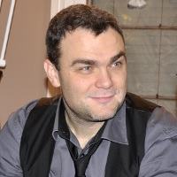

## 5 décembre 2018 - CTF What? Présentation du monde CTF\! « Capture The Flag »

 

**Franck Desert**
 Analyste en sécurité applicative
 CGI Inc
   

#### Description

Attaque/Défense, Jeopardy, Puzzle Technique, Retro ou New Tech, nous
allons vous raconter l'histoire, l'existant, ce qui s'en vient dans le
monde du CTF et présenter également le devant et le derrière du miroir.

Mais ne vous y trompez pas\! Le CTF devient la nouvelle façon de se
former, de rester sur le "Edge", de recruter, etc. Donc, que vous soyez
développeur, pentester, defender, chargé de projet, manager ou tout
simplement curieux, cette présentation est pour vous\! En effet,
l’apprentissage ludique qu’est le CTF doit prendre une place
importante dans votre quotidien, que vous le fassiez à titre personnel
ou afin de convaincre votre entreprise de l'intégrer, il est temps de
s’y mettre\!

Voici la présentation "[CTF What? Présentation du monde
CTF\!](https://fr.slideshare.net/secret/5MG3Lmv9Rv08AJ)"

#### Bio

Franck est architecte organique mais avant tout un enthousiaste de la
sécurité impliqués dans l’organisation du Hackfest. Très motivé à
partager ses 24 ans d’expérience en développement de systèmes, Franck
est excellent présentateur et n’a pas peur d’apporter du contenu dans
ses échanges avec les autres. Franck est aussi à surveiller avec ses
idées/projets/initiatives orienté communauté qui sont particulièrement
à la fine pointe