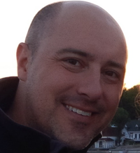

**Patrick Leclerc**
 Leader du chapitre OWASP Ville de Québec
 Conseiller en sécurité applicative
 La Capitale / Beneva 

#### Résumé de la rencontre

Les gens présents ce sont prononcés sur la raison d'être de notre chapitre:

  - Nous sommes une communauté locale de sensibilisation, d’échange et d’entraide en sécurité applicative, et nous voulons le rester.
  - Nous voulons favoriser les rencontres en présentiel, en toute collégialité, afin de créer des rapprochements, un sentiment d'appartenance et une plus grande fraternité entre les gens, ce qui favorise les échanges et l’entraide.
  - Le cas échéant de défaut de conférencier, nous pouvons tenir la rencontre juste pour échanger (SVP, avisez-nous pour que nous puissions au moins avoir un ordre du jour!).
  - Cependant, les rencontres virtuelles vont se prolonger tant qu’il existe des contraintes liées à la pandémie et ses mesures sanitaires ou lorsqu’il y existe des contraintes logistiques de déplacements des conférenciers.

#### Planification des rencontres
  - Nous allons idéalement planifier nos rencontres aux 2 mois, plus fréquemment si nécessaire, les premiers mardis du mois, dès le 7 décembre 2021.
  - Les rencontres devraient se dérouler les mardis de préférence, les mercredis en second choix et idéalement en début de soirée.
  - Nous devons tenir nos rencontres en présentiel dans au lieu accessible à tous, particulièrement pour nos étudiants.
 