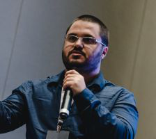
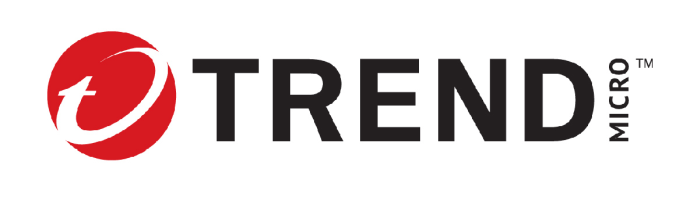

## 15 Novembre 2023: Conference: OWASP Top 10 CI/CD Security Risks

**Magno Logan**
 Information Security Specialist
 Trend Micro 
 
 
 
 
 

### Description:

This talk is designed for software developers, security professionals, and anyone involved in the software development lifecycle interested in learning about common security risks that can occur in continuous integration and continuous deployment (CI/CD) environments. During the talk, participants will learn about the most critical items on the OWASP Top 10 CI/CD Security Risks, which include vulnerabilities such as dependency chain abuse, poisoned pipeline and insufficient flow control, PBAC, credential hygiene, and logging.

***>> This talk will be in English <<***

### Bio:

As an Information Security Specialist, Magno Logan specializes in Cloud, Container, Application Security Research, Threat Modeling, and Kubernetes Security. He is a sought-after speaker at worldwide security conferences and founded the JampaSec Security Conference and the OWASP Paraiba Chapter. He has previously served as a Snyk Ambassador and member of the CNCF Security TAG.

### Date et heure: 

	Mercredi, 15 Novembre 2023
		Accueil / enregistrement	: 17:00 - 17:50
		Annonces de chapitre		: 17:50 - 18:00
		Conférence			: 18:00 – 19:00
		Discussions libres		: 19:00

### Lieu

**Pacini Québec Sainte-Foy** 
999, avenue de Bourgogne 
Québec (Québec)  G1W 4S6 

### Commanditaire de l'événement:

Merci à **Trend Micro**, commanditaire de l'événement! 
Bouchées et breuvages seront servis, gracieuseté de notre commanditaire.

### RSVP! Places limitées!

[**Inscription gratuite et obligatoire!**](https://www.eventbrite.ca/e/conference-owasp-top-10-cicd-security-risks-tickets-740575831247?aff=oddtdtcreator)

 
 
