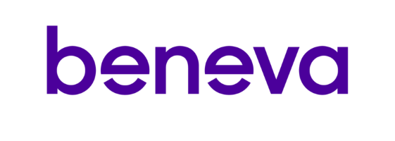

---
<!--
  Ceci est un commentaire
-->
## Événement à venir

### 2 Juillet 2024: Conference: ChatGPT comme assistant de programmation: atout ou risque?

**Raphaël Khoury, Ph.D., P. Eng** 
Professeur 
Université du Québec à Gatineau

 

#### Description:

Les LLMs, tel que ChatGPT, sont de plus en plus utilisés par les programmeurs pour générer des fragments de code, et même des programmes entiers. Cependant, le niveau de sécurité du code ainsi généré est imparfait. Dans cette présentation, nous passerons en revue les recherches initiales effectuées pour évaluer la capacité des LLMs à générer du code sécuritaire, ainsi qu’à effectuer d’autres tâches de sécurité telles que détecter et classer les vulnérabilités dans le code, de même que corriger des vulnérabilités qui sont subséquemment identifiées.

#### Bio:

M. Khoury a obtenu son doctorat en sécurité informatique de l'Université Laval et a été chercheur postdoctoral au centre de Recherche et développement pour la défense Canada (RDDC-RDDC) à Valcartier, au Canada. Il est actuellement professeur à l’université du Québec à Gatineau.  Ses recherches portent sur tous les aspects de la sécurité des logiciels, et est l’auteur du livre « La Sécurité Logicielle : une approche défensive ». Il est récipiendaire de subventions de recherche du FQRNT et du CRSNG. Ses recherches ont également été financées par l'industrie.

 

#### Détails de l'événement:

| Date       | Time          | Activity                 |
|------------|---------------|--------------------------|
| 2024-07-02 | 17:30 - 17:50 | Accueil / enregistrement |
|            | 17:50 - 18:00 | Annonces de chapitre     |
|            | 18:00 - 19:00 | Conférence               |
|            | 19:00         | Discussions libres       |

 

#### Lieux:
[**Pacini Québec Sainte-Foy**](https://pacini.com/en/italian-restaurant-quebec-stefoy/)  
999, avenue de Bourgogne 
Québec (Québec)  G1W 4S6 
 

#### Commanditaire:

Merci à [**Beneva**](https://beneva.ca), fière commanditaire de l'événement! 
Bouchées et breuvages seront servis, et des prix de présence seront distribués aux personnes présentes, gracieuseté de notre commanditaire.
 
 

#### RSVP! Places limitées!

[**Inscription gratuite et obligatoire!**](https://www.meetup.com/fr-FR/owasp-quebec-city-chapter/events/301421240/)

---

# Annonces!

  
 Recherche de leaders ou de volontaires
 

Après plusieurs années comme co-leader du chapitre OWASP Ville de Québec, Louis Nadeau songe à passer le flambeau très prochainement. Joignez-vous à moi pour le remercier de ses précieux et loyaux services pour notre communauté!

Si vous désirez vous investir dans votre chapitre local en tant que membre du leadership ou tout simplement comme volontaire, ou que vous avez des idées pour bonifier notre offre, [écrivez-moi](mailto:patrick.leclerc@owasp.org). 

Entre autres nous avons des besoins suivants:

  - Trouver des présentateurs de contenu liés à la sécurité applicative 
  - Organiser conférences, activités, formations, partenariats académiques
  - Participer à la logistique du site web, liste de distributon, plateformes de diffusion et des médias sociaux
  - Faire rayonner le domaine de la sécurité applicative et l'organisation OWASP en donnant des conférences

  

---

  
 Appel de conférenciers pour 2024
 

Voici à titre indicatif quelques idées de présentations en lien avec la sécurité applicative, vos sujets nous intéressent également, alors faites-nous en part!:

  - Démonstration d’utilisation d'outils de sécurité disponibles gratuitement ou open source
  - Couverture d'un élément du Top 10 OWASP (ex : XXE, Insecure deserialization, Insufficient logging and monitoring)
  - Méthodes, processus et outils de vérifications du code
  - Exploitations de vulnérabilités, contournements de mécanismes de sécurité, comment les prévenir
  - Sécurité des applications dans les architectures micro-service
  - Enjeux et sécurité des API
  - Retour sur expériences dans la résolution et/ou l'implantation de fonctions de sécurité
  - Retours d'expérience, projets de recherches, discussions ouvertes, workshops, brainstorming, Etc.

Logistique :

  - Les présentations ont généralement une durée de 40 minutes à 75 minutes.
  - Elles ont lieu préférablement un mardi ou mercredi dès 19h (toutefois nous sommes ouverts à prendre d'autres arrangements si nécessaire).
  - Nous pouvons fournir la plateforme de diffusion, ou si vous préférez utiliser la vôtre du moment qu’elle est facilement accessible à tous.
  - Le contenu de la présentation devrait nous être soumis au moins 2 semaines à l'avance afin que nous puissions vérifier qu'elle respecte les valeurs de neutralité et d'impartialité d’OWASP.

Notes :

  - La neutralité et l'impartialité sont de mise, vos opinions sont bienvenues en autant qu'elles soient exprimées dans le respect.
  - Toute intervention orale (présentation, formation) lors d'un meeting OWASP est soumise à l'acceptation préalable du règlement des conférenciers.
  - La vente de produits est strictement interdite.

---
Nos réunions sont ouvertes au public et vous n'avez pas besoin d'être membre pour y assister. 
Merci d'envisager de [devenir membre OWASP](https://owasp.org/membership/) et parrainer notre chapitre.
