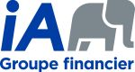

## 24 mars 2020: Faits marquants du top 10 des nouvelles techniques d’attaque web de 2019

**Dario Martins Silva**
Sécurité des applications
Bentley Systems

#### Description
Il peut être difficile de rester à l’affut de toutes les nouvelles qui touchent à la sécurité web. Pour nous aider à ne rien manquer, PortSwigger compile à chaque année 10 techniques d’attaque web qui présentent des concepts novateurs. Nous explorerons quelques-unes de ces techniques ensemble.

#### Lieu
Local A225 du Cégep de Sainte-Foy

#### Horaire
18:15 - 18:30 Accueil
18:30 - 20:00 Conférence
20:00 - Réseautage et sortie dans un pub pour les intéressés

#### Stationnement
Le stationnement accessible à partir de la rue Nicolas Pinel est gratuit à partir de 18h00

#### Ouvert à tous! Inscription gratuite! RSVP!

#### Merci à notre partenaire académique pour l'événement

## **Prochaines activités OWASP Québec**

-  20 avril 2020: Threat Modeling wins in Agile AppSec
-  4 juin 2020: sujet à confirmer

## **OWASP Ville de Québec est à la recherche de conférenciers\!**

Si vous souhaiteriez présenter, pour l’avancement de la science et de la
connaissance en sécurité applicative, un sujet lors d'une prochaine
rencontre OWASP, SVP communiquez avec nous\!

- [Patrick Leclerc](mailto:patrick.leclerc@owasp.org)
- [Louis Nadeau](mailto:louis.nadeau@owasp.org)

**Voici à titre indicatif quelques idées de présentations en lien avec
la sécurité applicative, vos sujets nous intéressent également, alors
faites-nous en part\! :**

  - Démonstration d’utilisation d’outils de sécurité disponibles
    gratuitement ou open source (ex : ZAP, AppSensor, FindSecBugs, Burp,
    BeEF, ModSecurity, etc.).
  - Les démonstrations et/ou retours d’expérience d’outils de sécurité
    applicative commerciaux sont permis, toutefois dans un souci de
    neutralité et d’indépendance, nous demandons à ce que ces
    présentations demeurent impartiales
  - Couverture d’un élément du Top 10 OWASP 2017 (ex : XXE, Insecure
    deserialization, Insufficient logging and monitoring)
  - Méthodes et outils de vérifications du code
  - Exploitations de vulnérabilités, contournements de mécanismes de
    sécurité, comment les prévenir
  - Sécurité des applications dans les architectures Web n-tiers et
    micro-services
  - Retour sur expériences dans la résolution et/ou l’implantation de
    fonctions de sécurité
  - Les pièges à éviter dans les configurations CORS
  - L’usage sécuritaire des JWT
  - Projets de recherches, discussions ouvertes, workshops,
    brainstorming

**Logistique :**

  - Les présentations devraient être de 45 minutes à 75 minutes maximum.
  - Elles débutent généralement après 18h, en fonction des institutions
    qui nous fourniront les locaux.

**Notes :**

  - La neutralité et l’impartialité sont de mise, vos opinions sont
    bienvenues en autant qu'elles soient exprimées dans le respect
  - Toute intervention orale (présentation, formation) lors d'un meeting
    OWASP est soumise à l'acceptation préalable du règlement des
    conférenciers
  - La vente de produits est strictement interdite.

## Chapter Supporters / Commanditaires du chapitre

### Gold / Or

