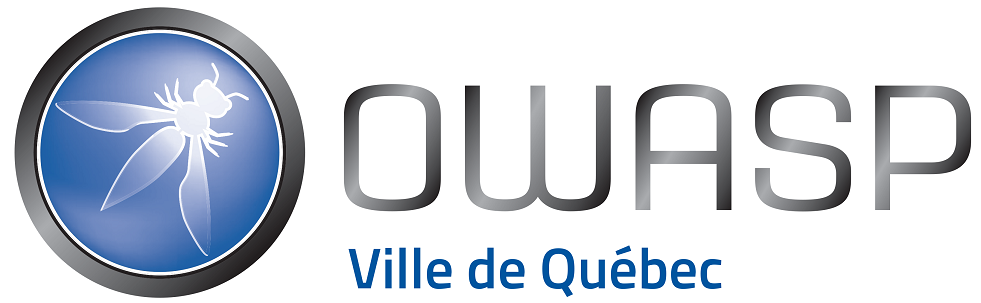

---
<!--
  Ceci est un commentaire
-->
# Événement à venir

# Sécurité des applications avec OWASP  
 **Événement à ne pas manquer !**

### Date et heure  
**mercredi 23 avril 2025**, de **18:00 à 20:00 (EDT)**  
*(Durée : 2 heures)*  

### Lieu  
**Cégep de Sainte-Foy**  
2410, chemin Sainte-Foy  
Québec (QC) G1V 1T2  
Le stationnement désigné sera le stationnement à l’arrière du Cégep. Comme il y a un spectacle le mercredi de notre conférence, il suffit de mentionner aux préposés de stationnement que c’est un événement privé et vous serez dirigés vers le stationnement arrière. Ce sera gratuit pour tous.
Local Sci-napse (B140). En se stationnant dans le stationnement arrière, le Sci-napse sera facilement accessible par là.
Il y aura 50 chaises disponibles, ainsi que les fauteuils du Sci-napse si jamais on déborde.
Nous aurons des boissons gazeuses et des chips! :)

---

### À propos de l'événement  
Rejoignez-nous le mercredi 23 avril pour une conférence sur 
l'incontournable **Top 10 de l’OWASP**, présentée par **Patrick Leclerc**, 
co-leader du chapitre OWASP Ville de Québec.  
Cet événement est ouvert :  
- Aux étudiants  
- Aux professionnels chevronnés  
- À tous ceux souhaitant rafraîchir leurs connaissances ou échanger sur 
les bonnes pratiques en sécurité informatique.

---

### Programme  
1. Présentation du **Top 10 OWASP** : qu'est-ce que c'est ?  
2. Données et méthodologies utilisées  
3. Questions/réponses avec le présentateur  

---

### Participation  
 **Places limitées** – Inscription recommandée !  

👉 [Inscription sur Eventbrite](https://www.eventbrite.ca/e/securite-des-applications-avec-owasp-tickets-1313170912549)  

---

# Annonces!

  
 Recherche de volontaires

Si vous désirez vous investir dans votre chapitre local en tant que bénévole, ou que vous avez des idées pour bonifier notre offre, [écrivez-moi](mailto:patrick.leclerc@owasp.org). Nous recherchons des personnes intéressées à:

- Trouver des présentateurs de contenu liés à la sécurité applicative
- Organiser conférences, activités, formations, partenariats académiques
- Participer à la logistique du site web, liste de distribution, plateformes de diffusion et des médias sociaux
- Faire rayonner le domaine de la sécurité applicative et l'organisation OWASP en donnant des conférences

---

  
 Appel de conférenciers pour 2025

Voici à titre indicatif quelques idées de présentations en lien avec la sécurité applicative, vos sujets nous intéressent également, alors faites-nous en part!

- Démonstration d’utilisation d'outils de sécurité disponibles gratuitement ou open source
- Couverture d'un élément du Top 10 OWASP (ex : XXE, Insecure deserialization, Insufficient logging and monitoring)
- Méthodes, processus et outils de vérifications du code
- Exploitations de vulnérabilités, contournements de mécanismes de sécurité, comment les prévenir
- Sécurité des applications dans les architectures micro-service
- Enjeux et sécurité des API
- Retour sur expériences dans la résolution et/ou l'implantation de fonctions de sécurité
- Retours d'expérience, projets de recherches, discussions ouvertes, workshops, brainstorming, Etc.

Logistique :

- Les présentations ont généralement une durée de 40 minutes à 75 minutes.
- Elles ont lieu préférablement un mardi ou mercredi dès 19h (toutefois nous sommes ouverts à prendre d'autres arrangements si nécessaire).
- Nous pouvons fournir la plateforme de diffusion, ou si vous préférez utiliser la vôtre du moment qu’elle est facilement accessible à tous.
- Le contenu de la présentation devrait nous être soumis au moins 2 semaines à l'avance afin que nous puissions vérifier qu'elle respecte les valeurs de neutralité et d'impartialité d’OWASP.

Notes :

- La neutralité et l'impartialité sont de mise, vos opinions sont bienvenues en autant qu'elles soient exprimées dans le respect.
- Toute intervention orale (présentation, formation) lors d'un meeting OWASP est soumise à l'acceptation préalable du règlement des conférenciers.
- La vente de produits est strictement interdite.

---
Nos réunions sont ouvertes au public et vous n'avez pas besoin d'être membre pour y assister. 
Merci d'envisager de [devenir membre OWASP](https://owasp.org/membership/) et parrainer notre chapitre.
