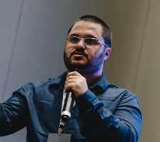

---
## Actualités

## Upcoming Event

### 15 Novembre 2023: Conference: OWASP Top 10 CI/CD Security Risks

**Magno Logan** 
Information Security Specialist 
Trend Micro

 

#### Description:

This talk is designed for software developers, security professionals, and anyone involved in the software development lifecycle interested in learning about common security risks that can occur in continuous integration and continuous deployment (CI/CD) environments. During the talk, participants will learn about the most critical items on the OWASP Top 10 CI/CD Security Risks, which include vulnerabilities such as dependency chain abuse, poisoned pipeline and insufficient flow control, PBAC, credential hygiene, and logging.

***>> This talk will be in English <<***

#### Bio:

As an Information Security Specialist, Magno Logan specializes in Cloud, Container, Application Security Research, Threat Modeling, and Kubernetes Security. He is a sought-after speaker at worldwide security conferences and founded the JampaSec Security Conference and the OWASP Paraiba Chapter. He has previously served as a Snyk Ambassador and member of the CNCF Security TAG.

#### Event Details:

| Date       | Time          | Activity                 |
|------------|---------------|--------------------------|
| 2023-11-15 | 17:00 - 17:50 | Welcome / Registration   |
|            | 17:50 - 18:00 | Chapter Announcements    |
|            | 18:00 - 19:00 | Conference               |
|            | 19:00         | Open Discussions         |

**Location:** 
Pacini Québec Sainte-Foy 
999, avenue de Bourgogne 
Québec (Québec)  G1W 4S6 

#### Event Sponsor:

Merci à **Trend Micro**, commanditaire de l'événement! 
Bouchées et breuvages seront servis, gracieuseté de notre commanditaire.

#### RSVP! Places limitées!

[**Inscription gratuite et obligatoire!**](https://www.eventbrite.ca/e/conference-owasp-top-10-cicd-security-risks-tickets-740575831247?aff=oddtdtcreator)

---

## Annonces!

  
Recherche de leaders ou de volontaires

  Après plusieurs années comme co-leader du chapitre OWASP Ville de Québec, Louis Nadeau songe à passer le flambeau très prochainement. Joignez-vous à moi pour le remercier de ses précieux et loyaux services pour notre communauté!

  Si vous désirez vous investir dans votre chapitre local en tant que membre du leadership ou tout simplement comme volontaire, ou que vous avez des idées pour bonifier notre offre, [écrivez-moi](mailto:patrick.leclerc@owasp.org). 

  Entre autres nous avons des besoins suivants:
  - Trouver des présentateurs de contenu liés à la sécurité applicative 
  - Organiser conférences, activités, formations, partenariats académiques
  - Participer à la logistique du site web, liste de distributon, plateformes de diffusion et des médias sociaux
  - Faire rayonner le domaine de la sécurité applicative et l'organisation OWASP en donnant des conférences

  
Appel de conférenciers pour 2024

  Voici à titre indicatif quelques idées de présentations en lien avec la sécurité applicative, vos sujets nous intéressent également, alors faites-nous en part!:

  - Démonstration d’utilisation d'outils de sécurité disponibles gratuitement ou open source
  - Couverture d'un élément du Top 10 OWASP (ex : XXE, Insecure deserialization, Insufficient logging and monitoring)
  - Méthodes, processus et outils de vérifications du code
  - Exploitations de vulnérabilités, contournements de mécanismes de sécurité, comment les prévenir
  - Sécurité des applications dans les architectures micro-service
  - Enjeux et sécurité des API
  - Retour sur expériences dans la résolution et/ou l'implantation de fonctions de sécurité
  - Retours d'expérience, projets de recherches, discussions ouvertes, workshops, brainstorming, Etc.

Logistique :

  - Les présentations ont généralement une durée de 40 minutes à 75 minutes.
  - Elles ont lieu préférablement un mardi ou mercredi dès 19h (toutefois nous sommes ouverts à prendre d'autres arrangements si nécessaire).
  - Nous pouvons fournir la plateforme de diffusion, ou si vous préférez utiliser la vôtre du moment qu’elle est facilement accessible à tous.
  - Le contenu de la présentation devrait nous être soumis au moins 2 semaines à l'avance afin que nous puissions vérifier qu'elle respecte les valeurs de neutralité et d'impartialité d’OWASP.

Notes :

  - La neutralité et l'impartialité sont de mise, vos opinions sont bienvenues en autant qu'elles soient exprimées dans le respect.
  - Toute intervention orale (présentation, formation) lors d'un meeting OWASP est soumise à l'acceptation préalable du règlement des conférenciers.
  - La vente de produits est strictement interdite.

---
Nos réunions sont ouvertes au public et vous n'avez pas besoin d'être membre pour y assister. 
Merci d'envisager de [devenir membre OWASP](https://owasp.org/membership/) et parrainer notre chapitre.

